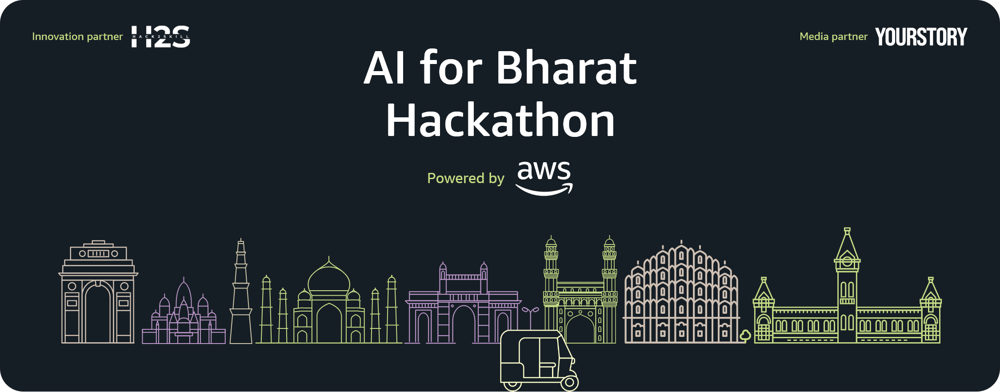
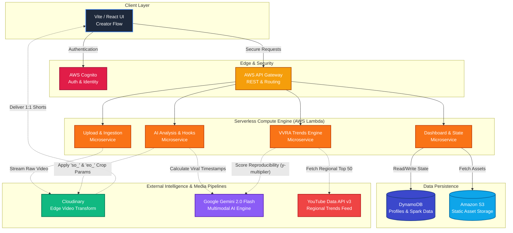

<div align="center">
  
</div>

# Vibe Collab AI

<div align="center">
  
</div>

<div align="center">
  <h3>The Preeminent 1-to-Many Content Engine for Regional Creators.</h3>
</div>

**Live Production:** [https://main.d16fcylhtesdpm.amplifyapp.com/dashboard/](https://main.d16fcylhtesdpm.amplifyapp.com/dashboard/)

<div align="center">
  
  
  
  
  
  
</div>

---

## 🌍 Executive Summary

India's creator economy is exploding across Tier 2 and Tier 3 cities. Yet, regional creators face a massive bottleneck: post-production. They spend 80% of their time editing rather than creating, struggling to adapt long-form content for short-form platforms (Reels, Shorts, TikTok).

**Vibe Collab AI** is a serverless, end-to-end content engine designed to eradicate this bottleneck. We automate the entire post-production pipeline—identifying viral hooks, instantly trimming videos, and syndicating content—allowing creators to focus entirely on their craft.

## 📊 System Architecture

_Reference diagram for the Vibe Collab AI backend pipeline._



---

## ☁️ Core Architecture & Tech Stack

| Component              | Technology                | Purpose                                                                                                          |
| :--------------------- | :------------------------ | :--------------------------------------------------------------------------------------------------------------- |
| **Frontend Framework** | React + Vite (TypeScript) | Lightning-fast HMR and optimized production builds for seamless UI/UX.                                           |
| **API Layer**          | AWS API Gateway           | Secure, scalable REST endpoints routing client requests to serverless compute.                                   |
| **Compute**            | AWS Lambda                | Serverless execution for uploading, analyzing, and matchmaking without provisioning infrastructure.              |
| **Database**           | AWS DynamoDB              | Infinite-scale, ultra-low latency NoSQL database for user profiles, state, and The Spark data.                   |
| **Storage**            | AWS S3                    | Durable, scalable object storage for static assets and raw audio files.                                          |
| **Video Engine**       | Cloudinary                | Instant video ingestion and edge CDN delivery with dynamic URL-based transformations (trimming, formatting).     |
| **AI Brain**           | Google Gemini 2.0 Flash   | Advanced multimodal inference for high-speed script analysis, semantic matchmaking, and viral hook timestamping. |
| **Authentication**     | AWS Cognito               | Enterprise-grade identity management and secure session handling.                                                |

---

## ✨ Core Pillars

### 1. Repurpose Lab (The Content Engine)

Turn one long video into multiple high-performing shorts — instantly.

> **⚠️ Demo Mode Active:** The full AI pipeline (Gemini 2.0 Flash + Cloudinary) is temporarily paused due to API quota limits during beta. The demo showcases the core client-side trim & crop engine.

- **Coming Soon Gate:** A polished "Coming Soon" banner greets users, explaining the API quota situation in a transparent, human tone. An **"Experience Demo"** CTA button smoothly animates away the banner and reveals the demo workspace.
- **Client-Side Trim & Square Crop (Demo):** Users upload any video → the first 10 seconds are extracted using the browser's native Canvas API + MediaRecorder → the video is intelligently center-cropped to a 1:1 square aspect ratio (720×720) → output is instantly previewable and downloadable.
- **Full Pipeline (Architecture):**
  - **Instant Ingestion:** Upload directly to Cloudinary CDN.
  - **AI Hook Detection:** Gemini 2.0 Flash identifies the most viral segment timestamps.
  - **Edge URL Trimming:** Cloudinary generates downloadable `.mp4` using `so_`/`eo_` URL parameters. Zero rendering time.

### 2. Smart Vault (VVRA Scoring Engine)

Data-driven trend intelligence, powered by math.

_Backend data and AI processing pipeline for the Smart Vault feature. Formatted into a stacked layout._

```mermaid
flowchart LR
    %% Increase diagram visual scale and padding
    classDef client fill:#1E293B,stroke:#3B82F6,stroke-width:2px,color:#fff,font-size:18px,padding:20px
    classDef api fill:#F59E0B,stroke:#B45309,stroke-width:2px,color:#fff,font-size:18px,padding:20px
    classDef ext fill:#EF4444,stroke:#B91C1C,stroke-width:2px,color:#fff,font-size:18px,padding:20px
    classDef math fill:#0EA5E9,stroke:#0369A1,stroke-width:2px,color:#fff,font-size:18px,padding:20px
    classDef ai fill:#8B5CF6,stroke:#5B21B6,stroke-width:2px,color:#fff,font-size:18px,padding:20px
    classDef result fill:#10B981,stroke:#047857,stroke-width:2px,color:#fff,font-size:18px,padding:20px

    %% Style the subgraphs to be bigger and spaced out
    style TOP fill:transparent,stroke:#555,stroke-width:2px,stroke-dasharray: 5 5,font-size:24px
    style BOTTOM fill:transparent,stroke:#555,stroke-width:2px,stroke-dasharray: 5 5,font-size:24px

    subgraph TOP [Phase 1: Ingestion & Parsing]
        direction LR
        A[User Opens<br/>React UI]:::client --> B[API Gateway<br/>VVRA Lambda]:::api
        B --> C[YouTube Data API<br/>Top 50 Trending]:::ext
        C --> D[Parse Metadata<br/>Views, Likes, Date]:::api
    end

    %% Invisible link to trick Mermaid into stacking the subgraphs cleanly
    TOP ~~~ BOTTOM

    subgraph BOTTOM [Phase 2: Math & AI Delivery]
        direction LR
        E[Base VVRA Score<br/>Velocity x Engage]:::math --> F[Filter Clickbait<br/>High View/Low Engage]:::math
        F --> G[Gemini 2.0 Flash<br/>Reproducibility Analysis]:::ai
        G --> H[Final Score<br/>Base x AI Multiplier]:::math
        H --> I[Frontend Renders<br/>Masonry 3D Cards]:::result
    end

    %% Connect the top row to the bottom row
    D -.-> |Data Handoff| E
```



- **Real-Time YouTube Ingestion:** Fetches the top 50 trending videos via YouTube Data API v3, extracting views, likes, comments, and publish timestamps per regional language.
- **VVRA Baseline Score:** Each video is scored using a proprietary formula that combines velocity with engagement density:
  ```
  VVRA_baseline = (views / hoursSincePublished) × ((likes + comments × 1.5) / views)
  ```
  This rewards content that is both fast-growing AND deeply engaging — filtering out clickbait with high views but low interaction.
- **Gemini γ Multiplier (Reproducibility Analysis):** The top 50 baseline results are batched to Gemini 2.0 Flash, which assigns a `reproducibility_multiplier` (0.5× to 2.0×) to each video. Solo-creator-friendly formats (commentary, tutorials, talking-head) receive 2.0×, while high-budget studio productions receive 0.5×.
  ```
  VVRA_final = VVRA_baseline × γ
  ```
- **Glowing VVRA Badge:** Each trend card displays a pulsing gradient badge showing the final VVRA score, with a separate γ chip indicating the Gemini multiplier.

### 3. The Spark

Never lose an idea.

- Distraction-free, brutalist interface for capturing raw thoughts, scripts, and mood boards.

### 4. Matchmaker

Semantic AI talent sync.

- Gemini 2.0 Flash calculates a "Synergy Score" based on a Creator's raw ideas (The Spark) matching against a network of editors, thumbnail artists, and producers.

---

## 🎨 UI/UX Philosophy: Brutalist Physics

Vibe Collab AI employs a strict "Nothing OS / Cyberpunk" design language.

| Philosophy Directive           | Implementation                                                                                                                                                     |
| :----------------------------- | :----------------------------------------------------------------------------------------------------------------------------------------------------------------- |
| **Deep-Cycle Frosted Headers** | `<nav>` elements use `backdrop-filter: blur(24px)` mixed with semi-transparent blacks (`rgba(0,0,0,0.85)`). Ensures content legibility without breaking immersion. |
| **Polarized Particle Physics** | Custom `<canvas>` background (`ParticleBackground.tsx`) with highly optimized, slow-drifting nodes matching the application state (e.g., accelerating on load).    |
| **Cinematic Easing**           | Framer Motion handles all route transitions and micro-interactions. Default bezier curve: `[0.22, 1, 0.36, 1]` for aggressive snap, smooth settle.                 |
| **Space Constraints**          | Absolute ban on rounded bubbliness. Borders are sharp (1px solid `rgba(255,255,255,0.08)`), padding is strictly fixed to `--space` CSS variables.                  |

---

## 💎 Business Model (Path to $1M ARR)

| Tier       | Price / Mo | Features                                                | Target               |
| :--------- | :--------- | :------------------------------------------------------ | :------------------- |
| **Entry**  | $0         | Basic Spark notes, 3 Repurpose trims/mo, Public Vault   | New Creators         |
| **Pro**    | $12        | Unlimited AI analysis, Matchmaker access, Private Vault | Regional Influencers |
| **Agency** | $49        | API Access, Batch processing, Team collaboration        | Content Agencies     |

---

_Built originally for the AI for Bharat AWS Hackathon. All backend architecture is currently deployed and hosted serverless on AWS._
